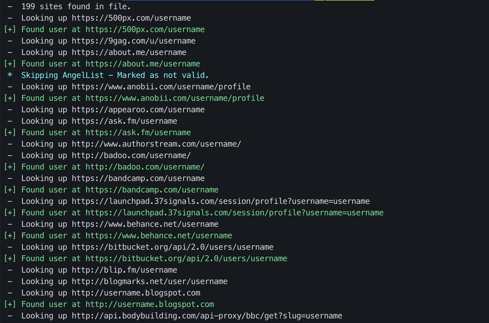
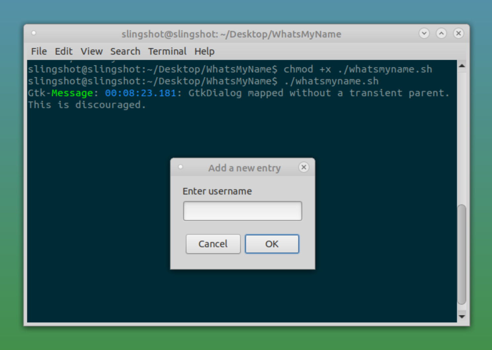

# WhatsMyName
This repository has the unified data required to perform user and username enumeration on various websites. 


[](https://shields.io/)
[](https://github.com/GetStream/winds/graphs/commit-activity)
[](https://github.com/GetStream/winds/graphs/commit-activity)


## Getting Started

### 1) Standalone Username Checker

#### Prerequisite

- Python 3.5+
- Python modules:
   - requests

To install required python modules :
```
pip3 install -r requirements.txt
```

To check username on sites using the Whatsmyname script run _Python 3_ script and replace `username` with the username you want to search for:

```
python3 ./web_accounts_list_checker.py -u username
```




#### Bash script for Linux users:
Linux users can use `whatsmyname.sh` bash script that uses _Zenity_ to pop up a window and ask for a username:
```
./whatsmyname.sh 
```



> For more check the project wiki.

<hr>

### 2) Using Web Accounts list JSON file in other projects 
You can use [web_accounts_list.json](web_accounts_list.json) file  easily  in other projects such as the ones below:
* [Recon-ng](https://bitbucket.org/LaNMaSteR53/recon-ng) - The [Profiler Module](https://bitbucket.org/LaNMaSteR53/recon-ng/src/7723096ce2301092906838ef73564e7907886748/modules/recon/profiles-profiles/profiler.py?at=master&fileviewer=file-view-default) grabs this JSON file and uses it. See https://webbreacher.com/2014/12/11/recon-ng-profiler-module/ for details.
* [Spiderfoot](https://github.com/smicallef/spiderfoot) uses this in the [sfp_account](https://github.com/smicallef/spiderfoot/blob/master/modules/sfp_accounts.py) module. There is also [this video](https://asciinema.org/a/295923) showing how to use this project using the Spiderfoot Command Line Interface (CLI).
* [sn0int](https://github.com/kpcyrd/sn0int) downloads and uses the JSON file in the [kpcyrd/whatsmyname](https://sn0int.com/r/kpcyrd/whatsmyname) module, see https://twitter.com/sn0int/status/1228046880459907073 for details and instructions.


<hr> 

## Web Accounts List Format
The format of the JSON is simple. There are 3 main elements:

1. License - The license for this project and its data.
2. Authors - The people that have contributed to this project.
3. Sites - This is the main data.

Within the `"sites"` elements, the format is as follows (with several parameters being optional):

```json
 ...
  {
     "name" : "name of the site",
     "check_uri" : "URI to check the site with the {account} string replaced by a username",
     "pretty_uri" : "if the check_uri is for an API, this OPTIONAL element can show a human-readable page",
     "account_existence_code" : "the HTTP response code for a good 'account is there' response",
     "account_existence_string" : "the string in the response that we look for for a good response",
     "account_missing_string" : "this OPTIONAL string will only be in the response if there is no account found ",
     "account_missing_code" : "the HTTP response code for a bad 'account is not there' response",
     "known_accounts" : ["a list of user accounts that can be used to test","for user enumeration"],
     "category" : "a category for what the site is mainly used for",
     "valid" : "this true or false boolean field is used to enable or disable this site element"
  },
  ...
```

Here is an example of a site element:

```json
 ...
  {
     "name" : "GitHub",
     "check_uri" : "https://api.github.com/users/{account}",
     "pretty_uri" : "https://github.com/{account}",
     "account_existence_code" : "200",
     "account_existence_string" : "login:",
     "account_missing_string" : ["Not Found"],
     "account_missing_code" : "404",
     "known_accounts" : ["test","webbreacher"],
     "category" : "coding",
     "valid" : true
  },
  ...
```

<hr> 

## Known Issues

1. SSL handshakes issue:

   Had an issue with SSL handshakes and this script. Had to do the following to get it working:
    ```
    sudo apt-get install libffi-dev
    ```
    
    ```
    pip install pyOpenSSL ndg-httpsclient pyasn1 requests
    ```
    > From https://github.com/kennethreitz/requests/issues/2022
   
<hr> 

## Updates
I update this project as I have time and would *LOVE* to have interested people help maintain and grow it.<br> 
Please reach to me `webbreacher@protonmail.com` if you are interested.

### Todo list

- [ ] Make it so the script will toggle validity factor per entry and write to output file
- [ ] Make it so the script will append comment to the entry and output to file
- [ ] Make a stub file shows last time sites were checked and problems.


### Contributors
[@WebBreacher](https://github.com/WebBreacher/)<br>
[@Munchko](https://github.com/Munchko/)<br>
[@L0r3m1p5um](https://github.com/L0r3m1p5um/)<br>
[@lehuff](https://github.com/lehuff/)<br>
[@arnydo](https://github.com/arnydo)<br>
[@janbinx](https://github.com/janbinx/)<br>
[@bcoles](https://github.com/bcoles)<br>
[@Sector035](https://github.com/sector035/)<br>

## License
<a rel="license" href="http://creativecommons.org/licenses/by-sa/4.0/"></a><br />

This work is licensed under a <a rel="license" href="http://creativecommons.org/licenses/by-sa/4.0/">Creative Commons Attribution-ShareAlike 4.0 International License</a>.
